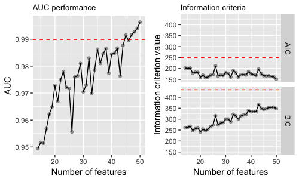

# Background

* A motivating example: do gene interactions help predict cancer type?
* How to determine interactions in high dimensions *optimally*?
* Focus on pairwise interaction terms (no quadratic terms)
* Given $p$ features with 2-way pairwise interaction terms, the number of possible features is 

$$p + {p\choose2} = \frac{p(p+1)}{2}$$

* SP-FSR algorithm [@vural] shows excellent performance in feature selection. Can we utilise it to identify interaction terms?

# Organisation of the presentation

1. Basic terminology
2. Earlier and current methods to identify pairwise interaction terms
3. SP-FSR algorithm for interaction identification
4. Experimental setup and results
5. Discussion
6. Conclusion

# Notations and terminology

* $Y$: response feature
* $X_{j}$: explanatory feature $j$ for $j=1,2,...p$
* Model formulation:

$$g(Y) = \beta_0 + \sum_{j=1}^{p}\beta_j X_{j} + \sum_{i<j}\beta_{i:j}X_{j}X_{i}$$

* A precise definition [@glinternet, p.1]: 

> \color{blue}"When a function $f(x_1, x_2)$ cannot be expressed as $h_1(x_1) + h_2(x_2)$ for some functions $h_1$ and $h_2$, we say that there is an interaction in $f$ between $x_1$ and $x_2$."\color{black}

* Introduction of "hierarchy"

# Terminology: hierarchy

@glinternet define:

\begin{center}
  \begin{tabular}{| l | p{6.5cm} |}
    \hline
     Hierarchy & Description\\
    \hline
    Strong & Interactions are only among pairs of nonzero main effects \\ \hline
    Weak   & Each interaction has only one of its main effects present \\ \hline
    Anti-hierarchical & Interactions are only among pairs of main effects that are not present \\ \hline
    Pure interaction & No main effects present; only interactions \\
    \hline
  \end{tabular}
\end{center}

# Terminology: an example of hierarchy

Consider three explanatory features: $\bold{X} = \{X_1, X_2, X_3\}$

1. Strong hierarchy: $\{X_1, X_2, X_1X_2\}$
2. Weak hierarchy:  $\{X_1, X_1X_2, X_1X_3\}$
3. Anti-hierarchical: $\{X_2, X_1X_3\}$
4. Pure interaction: $\{X_2X_3, X_1X_3, X_1X_2\}$

\color{red}In practice, how do we know? How can we detect?\color{black}

# Main methods to identify pairwise interaction terms

1. Statistical hypothesis test [@Cox1984]
2. Regularisation, e.g. LASSO
3. Wrapper Feature Selection [@wrapper]

# Statistical hypothesis test: an example

Considers two models:

1. $g(Y) = \beta_0 + \beta_1X_1 + \beta_2X_2$
2. $g(Y) = \beta_0 + \beta_1X_1 + \beta_2X_2 + \beta_{1:2}X_1X_2$

Run hypothesis on test on $\beta_{1:2} = 0$.

# Regularisation

* Let $l(y_i; \beta)$ be the **negative** log-likelihood contribution
* Elastic-net [@glmnet]

\begin{center}
  \begin{align*}
    \arg \min_{\beta}\frac{1}{n}\sum_{i=i}^{n}l(y_i; \beta) + \lambda[(1-\alpha)\parallel\beta\parallel^{2}_{2}/2+\alpha\parallel\beta\parallel_1]
  \end{align*}
\end{center}

* `glinternet` [@glinternet]: group-based LASSO ($\alpha = 1$) by imposing additional constraints on $\beta_{k:j}$ and $\beta_{j}$

# Wrapper feature selection

Extending feature selection by including interaction terms

1. SFFS: Sequential (Floating) Forward Selection [@SFFS]
2. \color{red}~~SFBS: Sequential (Floating) Backward Selection~~\color{black} [-@SFFS]
3. GA: Genetic Algorithm [@GA]
4. \color{blue} SP-FSR [-@vural]\color{black}

# SP-FSR algorithm

* Introduced by @vural
* Based on Simultaneous Perturbation Stochastic Approximation [@spall]
* Refined by @zeren
* Pseudo gradient descent method on the loss function
* `spFSR` package is now available in R [@spFSR]

# SP-FSR algorithm: pseudo code

# SP-FSR algorithm to identify interactions

* Assume a strong hierarchy
* Simplified version of **two-step SP-FSR** algorithm:

1. Identify the optimal set of $k$ main effects using SP-FSR
2. Search $k'$, number of interactions from $k$ main effects with SP-FSR

* $k$ and $k'$ can be determined via grid search or automatically

# Experimental setup

* Assume strong hierarchy
* Comparison methods: SP-FSR, SFFS, GA and `glinternet`
* Accuracy evaluation: Area under curve (AUC)
* Information criteria: AIC and BIC
* Model: logistic regression
* Datasets with binary targets:

1. Ionosphere
2. Sonar

# Experimental result: Ionosphere I

* Source: UCI (@uci)
* $n = 351, p = 33$

\begin{center}
    \begin{tabular}{ | l | l | l | l | l | l | }
    \hline
      Method & k & k' & AUC & BIC & AIC \\
    \hline
      GA & 17 & 71 & 0.9430 & 1747.094 & 1403.484\\
      glinternet & 25 & 23 & 0.9899 & 249.0249 & 434.3426 \\
      SFFS & 6 & 4 & 0.9402 & 197.1674 & 239.6360 \\
      SP-FSR (Full grid search) & 14 & 36 & 0.9963 & 151.2322 & 348.1323 \\
      SP-FSR (Automode) & 13 & 14 & 0.9825 & 145.0256 & 253.127 \\
      \hline
      Baseline & 33 & 0 & 0.9815 & 179.0528 & 310.3195 \\
    \hline
    \end{tabular}
\end{center}

Note: glinterent yields $\lambda$ of 0.0005

# Experimental result: Ionosphere II

```{r, echo = FALSE, fig.cap="Comparison between glinternet and SP-FSR with full grid search", message = FALSE, warning = FALSE, out.width='80%'}

```

# Experimental result: Ionosphere III

# Key critiques

* No experiments on other continuous and multinomial $Y$
* No assessment of underlying assumptions
* No quadratic and higher-order terms

# Conclusion

* SP-FSR
* The puzzle remains: do we really need to enforce (strong) hierarchy?

# Acknowledgement

* Dr Vural Aksakalli (VA) as my supervisor and mentor
* VA, Dr Babak Abbasi, and Zeren D. Yenice  for `spFSR` package
* Zeren D. Yenice, Niranjan Adhikari, Vural Aksakalli, Dr Alev Taskin Gumus, and Babak Abbasi for their previous works on SP-FSR algorithm

# References
