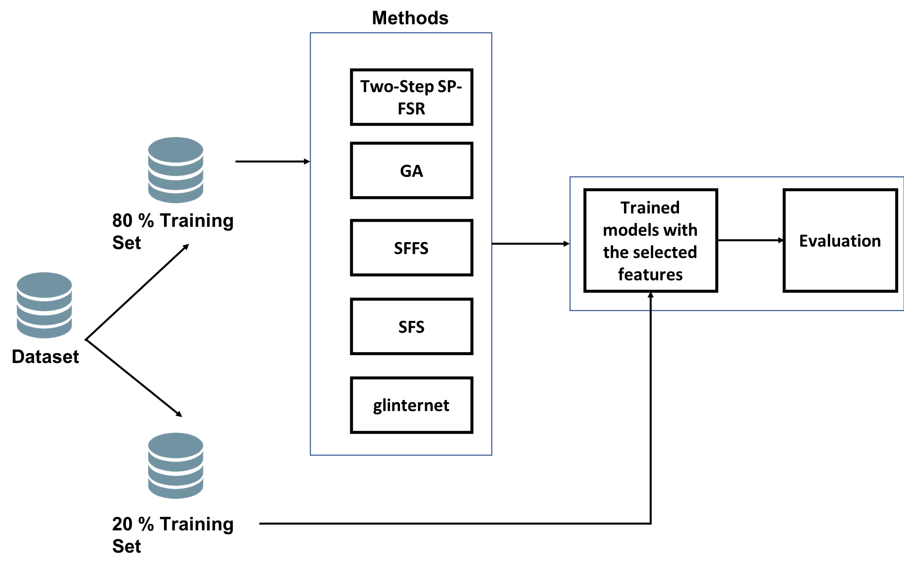

# Experimental Studies \label{study}

## Experimental Setup

We aim to compare the performance of two-step SP-FSR on regression and classificaton problems. As mentioned in Chapter \ref{RelatedApproaches}, the competitor methods are `glinternet`, SFFS, SFS and GA as well as the baseline learner. For the wrapper methods SFFS, SFS and GA, we use the same learning or wrapper model. `glinternet` has the similar model formulation, except that it imposes a penalty function on regression coefficients (see Equation \ref{glinternet}). For regression problems, the learning model is a simple linear regression (see Equation \ref{linearReg}) whereas it is a logistic regression model for classification problems (see Equation \ref{logisticReg}). To compare with two-step SP-FSR and `glinternet`, we impose a strong hierarchy on each wrapper method meaning corresponding main effects must be present for every interaction feature.

In our experiment, we split the underlying dataset into a training set and a test set by a ratio of 80:20 in each problem. We train the learning model with each feature selection method on the training set. During the feature selection process, we subsample the training set with a specified number of cross validations. We exempt the baseline learners from subsampling and feature selection. In other words, the baseline learners run on the full *training* set with all main effects only. Then we cast predictions on the test set with the train model from each feature selection method. Finally, by benchmarking against the baseline learners, we evaluate the performance of two-step SP-FSR and its competitors on the test set based on some error measures. For reproducibility, we run the experiment with a set of different random seeds.

While commonly used, we do not use information criteria, such as Akaike's Information Criterion (AIC) and Schwarz's Bayesian Criterion (BIC), in the feature selection procedure. Since information criteria rely on $n$, we opine that they are not appropriate because each sub-training set might have different number of observations during subsampling. Following the wrapper approach described by @kohavi, we use the error measures for performance benchmarking in the feature selection instead.

For regression tasks, we use root mean squared error (RMSE) for evaluation. RMSE is specific to the unit measurement of underlying $Y$; it is not biased upward like R-squared measure. A lower value RMSE indicates a higher accuracy rate. For binary classification tasks, we evaluate the methods using the area under the receiver operating characteristic (ROC) curve, or AUC. Loosely speaking, AUC measures the area of a plot True Positive Rate (TPR) against False Positive Rate (FPR). A logistic regression model returns probabilistic predictions and the predictions are classified into 0-1 response given a threshold level. We set the threshold at 0.5 which is used to compute TPR and FPR. A higher value of AUC implies a higher accuracy rate. 

Table \ref{tab1} lists the datasets for regression and classification tasks. These datasets are taken from [UCI Machine Learning Repository](http://archive.ics.uci.edu/ml) [@UCI] and [DCC Regression DataSets](http://www.dcc.fc.up.pt/~ltorgo/Regression/DataSets.html) [@DCC]. Each dataset's explanatory features are continuous. For regression tasks, we apply 10 cross validations on their training sets, except Boston Housing due to its small size. We use 4 cross validations instead. For each classification task, we apply stratified 5-cross validation sampling. Figure \ref{progress} depicts our experimental setup. On a computer with a processor of 2.3 GHz Intel Core i5, we run the experiment in `R` (Version 3.4.2) with the following packages:

* `glinternet` [@glinternet, Version 1.0.7] for hierarchical group-lasso regularization;
* `spFSR` [@spFSR, Version 1.0.0] to run Two-Step SP-FSR; and
* `mlr` packages [@mlr, Version 2.11] to implement SFS, SFFS and GA. 

The `R` scripts are explained further and presented in Appendix.

\begin{table}
    \centering
    \caption{Datasets for experiments. $p$ represents the number of explanatory features excluding exclude the response variables and identifier attributes; $n$ denotes the number of observations.}
    \label{tab1}
    \begin{tabular}{| l | l | l | l | l |}
    \hline
      Task & Dataset & $p$ & $n$ & Source \\
      \hline
      \multirow{3}{*}{Regression} & Ailerons  & 39 & 13750 & \href{https://www.dcc.fc.up.pt/~ltorgo/Regression/ailerons.html}{DCC} \\
                                  & Elevators & 17 & 16559 & \href{https://www.dcc.fc.up.pt/~ltorgo/Regression/elevators.html}{DCC} \\
                                  & Boston Housing & 13 & 506 & \href{https://archive.ics.uci.edu/ml/machine-learning-databases/housing/}{UCI} \\
      \hline
      \multirow{2}{*}{Classification} & Sonar & 9 & 214 & \href{http://archive.ics.uci.edu/ml/datasets/connectionist+bench+(sonar,+mines+vs.+rocks)}{UCI} \\
                                      & Ionosphere & 34 & 351 & \href{https://archive.ics.uci.edu/ml/datasets/ionosphere}{UCI} \\
      \hline
    \end{tabular}
\end{table}

```{r progress, fig.cap = '\\label{progress}Experimental Setup. The dataset is split into training and test sets by 80/20 ratio. The learning model is estimated based on the training set via various feature selection methods. The trained model is used to make predictions on the test sets. The test predictions are used to evaluate the performance of each method', out.width = "400px"}

```


## Regression Task Results

Table \ref{tab2} presents the empirical results of regression tasks. In this table, $p_0$ and $p_1$ represent the number of main-effect features selected and the number of interaction features respectively. $p_1$ does not apply to the baseline learner. Due to instability of SFFS implementation in `R`, we replace it with SFS for regression tasks. For a more reliable comparison, we evaluate each method based on their test RMSE values.

For Ailerons dataset, Two-Step SP-FSR reduces the test RMSE from the baseline value of 0.0179789 by approximately 5.8 % to 0.0169259. However, it comes to the second as `glinternet` yields the lowest RMSE at 0.0167777. GA and SFS underperform, especially GA which produces a higher test RMSE. As expected, SFS tends to choose a smaller subset of main-effect features and hence a smaller size of interaction. On average, Two-Step SP-FSR, `glinternet` and GA choose around 18 to 25 main-effect features. Two-Step SP-FSR results in a higher number of interactions ($p_1 \approx 120$), which is twice as those of `glinternet` and GA. 

For Boston Housing dataset, all methods beat the baseline learner. Two-Step SP-FSR outperforms other wrapper methods and reduces the baseline test RMSE by around 5.5 %. However, `glinternet` yields a superior result - an RMSE of 3.371138 down from the baseline value of 3.959734. On average, all methods select at least 9 out of 13 main-effect features where `glinternet` almost selects all ($p_0 \approx 12.9$). The number of interaction features varies such that `glinternet` results in the largest feature set. 

All methods beat the baseline learner as well in Elevator dataset. Two-Step SP-FSR leads other competitors with the lowest test RMSE at 0.2422305 equivalent to a reduction of 17.7 % from the baseline value. `glinternet` underperforms GA by a slight margin. Except for SFS, all methods choose at least 12 out of 18 main features. Two-Step SP-FSR produces the largest feature subset on average ($p_1 \approx 73$). 

\begin{table}
    \centering
    \caption{Empirical comparison of methods on regression tasks. $p_0$ represents the number of main-effect features selected. $p_1$ represents the number of interaction features selected. $p_1$ does not apply to the baseline learner. $p_0$ and $p_1$ are rounded to two nearest decimals. GA and SFS are abbreviations  of Genetic Algorithm and Sequential Forward Selection respectively. The best method is bolded in each dataset.}
    \label{tab2}
    \begin{tabular}{| l | l | r | r | r | r |}
    \hline
      Dataset & Method & Mean Test RMSE & Mean Train RMSE & $p_0$ & $p_1$ \\
    \hline 
    \multirow{5}{*}{Ailerons} 
      & Baseline        & 0.0179789 & 0.0171819 & 40.00 & NA \\
      & \color{blue}Two-Step SP-FSR	& \color{blue}0.0169259 & \color{blue}0.0157097	& \color{blue}21.33 & \color{blue}127.33\\
      & \bf{glinternet}	& \bf{0.0167777} & \bf{0.0157796}	& \bf{25.00} & \bf{64.00} \\
      & GA	            & 0.0198347	& 0.0156096	& 17.67 & 65.33 \\
      & SFS	            & 0.0173200	& 0.0165483	& 4.00	& 3.00 \\
    \hline
        & Baseline	& 3.959734	& 4.869756	& 13.00	& NA \\
Boston  & \color{blue}Two-Step SP-FSR	& \color{blue}3.739827	& \color{blue}3.277893	& \color{blue}9.92	& \color{blue}32.67 \\
Housing & \bf{glinternet}	& \bf{3.371138}	& \bf{3.106602}	& \bf{12.92}	& \bf{65.00} \\
        & GA	        & 3.840331	& 3.143898	& 10.75	& 27.75 \\
        & SFS         &	3.864182	& 3.334595	& 11.00	& 19.33 \\
    \hline
      \multirow{5}{*}{Elevators}
      & Baseline        &	0.2943325	& 0.2890896	& 18.00 &	NA \\
      & \color{blue}\bf{Two-Step SP-FSR}	& \color{blue}\bf{0.2422305}	& \color{blue}\bf{0.2394952}	&\color{blue}\bf{14.67} & \color{blue}\bf{73.00} \\
      & glinternet	    & 0.2506703	& 0.2485003	& 16.00 &	42.00 \\
      & GA	            & 0.2446648	& 0.2437792	& 12.33	& 43.00 \\
      & SFS	            & 0.2526974	& 0.2523360	& 7.00	& 3.00 \\
    \hline
    \end{tabular}
\end{table}

## Classification Task Results

Table \ref{tab3} presents the empirical results of classification tasks. Unlike regression tasks, we encounter no issues in implementing SFFS on the classification datasets. Similarly, we evaluate each method based on their test AUC values. For Sonar dataset, all methods as well the baseline logistic regression result in a perfect train AUC at 1. The exception is SFFS though its train AUC is as high as 0.96. Their test AUC values decline sharply below 0.7, suggesting all methods cause overfitting issues. This can be due to the small dataset. Two-Step SP-FSR yields a test AUC of 0.6810516 which is 12 % above the baseline value of 0.6059524. Although it tops other wrapper methods, it underperforms `glinternet` whose test AUC is 0.736.

Similarly, for Ionosphere dataset, Two-Step SP-FSR is the best wrapper method whereas GA and SFFS yield AUC values worse than the baseline logistic regression.  Two-Step SP-FSR ekes out an AUC of 0.84 - not significantly higher than the baseline whereas `glinternet` has a superior performance with an AUC above 0.90. In both datasets, `glinternet` selects the most number of main-effect features and consequently the most number of interactions on average. SP-FSR tends to select smaller feature subsets compared to GA but larger compared to SFFS.

\begin{table}
    \centering
    \caption{Empirical comparison of methods on classification tasks. $p_0$ represents the number of main-effect features selected. $p_1$ represents the number of interaction features selected. $p_1$ does not apply to the baseline learner. $p_0$ and $p_1$ are rounded to two nearest decimals. GA and SFFS are abbreviations  of Genetic Algorithm and Sequential Floating Forward Selection respectively. The best method is bolded in each dataset.}
    \label{tab3}
    \begin{tabular}{| l | l | r | r | r | r |}
    \hline
      Dataset & Method & Mean Test AUC & Mean Train AUC & $p_0$ & $p_1$ \\
    \hline 
    \multirow{5}{*}{Sonar} 
    & Baseline        & 0.6059524 & 1.0000000 & 60 & NA \\
    & \color{blue}Two-Step SP-FSR & \color{blue}0.6810516 & \color{blue}1.0000000  & \color{blue}16.42	& \color{blue}65.50 \\
    & \bf{glinternet}             & \bf{0.7367063}        & \bf{1.0000000}         & \bf{45.75} &	\bf{82.83} \\
    & GA	       & 0.6117063 & 1.0000000	& 22.00 &	110.42 \\
    & SFFS       & 0.6257937 & 0.9647436	& 11.67 &	7.17 \\
    \hline
    \multirow{5}{*}{Ionosphere} 
      & Baseline        & 0.8294573 & 0.9973914 & 33 & NA \\
      & \color{blue}Two-Step SP-FSR	& \color{blue}0.8432386 &	\color{blue}0.9797910	& \color{blue}12.083 & \color{blue}28.42 \\
      & \bf{glinternet}             &	\bf{0.9109963}      	& \bf{0.9913929}	& \bf{27.17}	& \bf{37.83} \\
      & GA	            & 0.7678366	& 0.9813844 & 15.83	& 59.42 \\
      & SFFS	          & 0.8207005	& 0.9580975	& 8.50  &	5.67 \\
    \hline
    \end{tabular}
\end{table}
